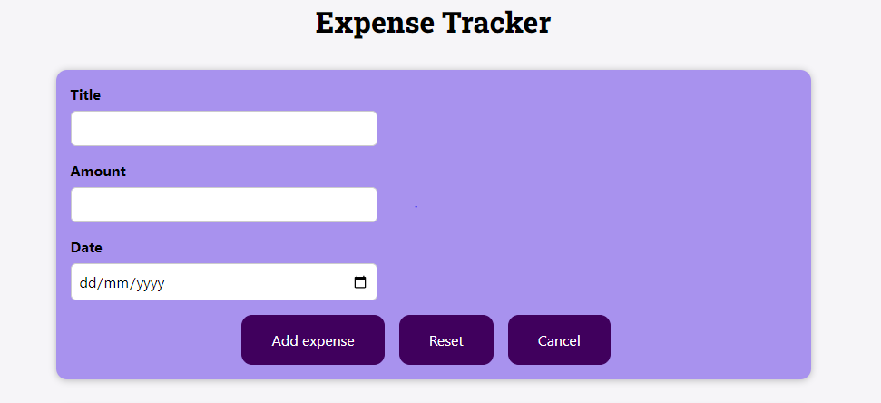

### Getting Started with a Simple Project in Reactjs

## Project Overview:-
 
This is an Expense Tracker mini project.
It consists of 3 segments such as add new Expense, Filter by year and Expense list.

## Common instructions:-

1. Install lastest version of Nodejs in your machine.
2. Download this Project from the git.
3. Go to the project directory and open the project using Vscode.
4. Then you have to install NPM (Node package Manager) which is the dependency of this project.

    Commands:

    # `npm install`
    # `npm start`

## Project Preview:-

